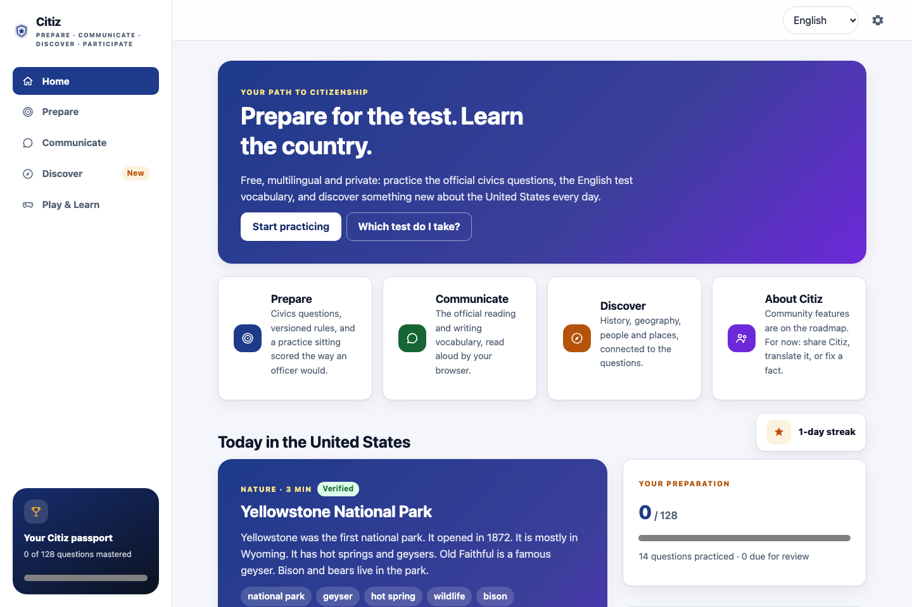
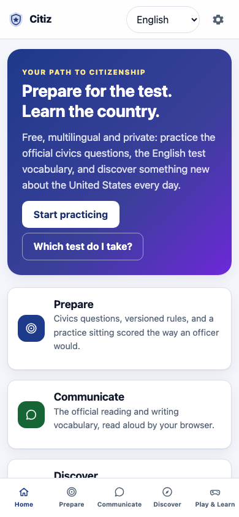
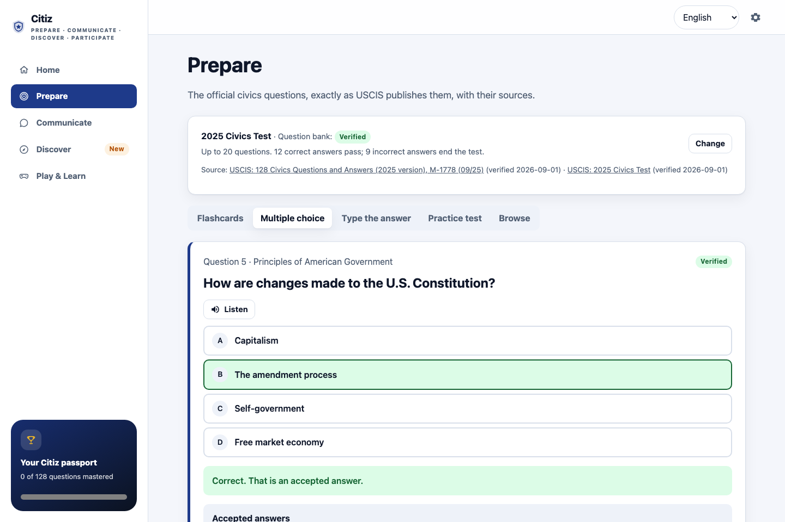

<p align="center">
  
</p>

<div align="center">

[](https://peopleworks.github.io/Citiz/)
[](https://github.com/peopleworks/Citiz/actions/workflows/ci.yml)
[](https://github.com/peopleworks/Citiz/actions/workflows/codeql.yml)
[](LICENSE)
[](content/README.md#licensing)
[](https://dotnet.microsoft.com/)
[](https://learn.microsoft.com/aspnet/core/blazor/)
[](https://github.com/peopleworks/Citiz/stargazers)

</div>

*¿Prefieres leer en español? → [README.es.md](README.es.md)*

**[Try it now →](https://peopleworks.github.io/Citiz/)** — runs in your browser, no account, nothing uploaded. Install it as an app from the browser menu and it works offline.

**Citiz** is a free, open-source, multilingual, privacy-first companion for people preparing for
United States citizenship. It practices the official civics questions the way an officer asks them,
drills the English test vocabulary, and teaches something about the country every day — and it does
all of it in your browser.

> 🔒 **Citiz runs entirely on your device.** There is no account, no server that sees what you
> study, no analytics. Your progress is saved in your browser and you can download or delete it at any
> time. The only thing Citiz ever asks you is *when you filed Form N-400*, so it can pick the right
> version of the test — and even that is optional.

Citiz is an **independent educational tool**. It is not affiliated with USCIS or any government
agency, it does not give legal advice, and it cannot guarantee the outcome of an interview or
application.

<table>
<tr>
<td width="68%" valign="top">

</td>
<td width="32%" valign="top">

</td>
</tr>
</table>

<sub>The same experience, reflowed for the screen: a sidebar on desktop, a bottom tab bar on
mobile — no separate app to build for either.</sub>

---

## What it does today (v0.4)

| Pillar | Built | How |
| --- | --- | --- |
| **Prepare** | Both official civics banks, **2008** (100 questions) and **2025** (128 questions), verified line by line against the USCIS documents | Flashcards with spaced review, multiple choice, type-the-answer with a deterministic checker, a **practice test scored exactly like the real one** (stops the moment the outcome is decided), and a browsable bank with sources |
| **Communicate** | The official **reading** and **writing** vocabulary lists | Tap a word to hear it (browser voice, on-device where the browser allows), dictation practice |
| **Discover** | Twelve "Today in the United States" capsules | Short sourced pieces linked to the questions they give context for |
| **Play & Learn** | *Civics challenge* | Ten multiple-choice rounds where every option is a real official answer; results count as practice |
| **Languages** | 7 interface languages | English, Spanish, Chinese (Simplified and Traditional), Filipino, Vietnamese, Arabic (right-to-left) — interface, study and help language are independent |

Also: a `citiz` command-line tool that validates every content file and language pack (the same
checks CI runs), resolves which test applies to a filing date, and runs a practice sitting in the
terminal; an optional API; a worker that watches the official sources for changes; a Dockerfile; a
GitHub Pages deployment.

**Not built yet** (designed, on the [roadmap](ROADMAP.md)): speech recognition and interview
simulation, AI explanations, the .NET MAUI hybrid apps, community features, the remaining games.

<p align="center">
  
</p>

<sub>Every question shows its source and its review status. A label such as <code>Not yet verified</code>
appears only while something has not been checked against the official USCIS document — today, nothing
in the banks carries one. Citiz never hides how sure it is.</sub>

## Which test do I take?

USCIS administers two versions of the civics test, depending on when Form N-400 was filed. Citiz
models this as data, not code, in [`content/exams/versions.json`](content/exams/versions.json):

| N-400 filed | Version | Bank | Asked | Pass | Test ends at |
| --- | --- | --- | --- | --- | --- |
| **Before October 20, 2025** | 2008 Civics Test | 100 | up to 10 | 6 correct | 5 incorrect |
| **On or after October 20, 2025** | 2025 Civics Test | 128 | up to 20 | 12 correct | 9 incorrect |

Applicants who are 65 or older with 20 or more years as permanent residents study a designated subset
of 20 questions and are asked up to 10 (the *65/20 special consideration*). Citiz has both lists,
copied from the official documents, so the 65/20 practice mode works for either version.

## Content you can trust, because you can check it

Everything a learner is told as a fact lives in [`content/`](content/README.md) as plain JSON, with
three rules that the validator and the tests enforce:

1. **Official text is transcribed, not paraphrased**, including the parentheses USCIS uses for
   optional words: `"(U.S.) Constitution"`. The answer checker understands that notation.
2. **Nothing is published without a source and a review status.** The interface labels anything that
   is not `approved`. Marking content approved is a human act.
3. **Answers that depend on who holds an office** (President, Speaker, your governor…) are never
   written into the bank. They live in `dynamic-answers.json` and are re-verified on their own
   schedule.

```
$ dotnet run --project src/Citiz.Cli -- content report

  File                                 Total Approved  Pending   By status
  exams/versions.json                      2        2        0   approved 2
  exams/2008/questions.json              100      100        0   approved 100
  exams/2025/questions.json              128      128        0   approved 128
  exams/dynamic-answers.json              10       10        0   approved 10
  english/reading-vocabulary.json          1        1        0   approved 1
  english/writing-vocabulary.json          1        1        0   approved 1
  discovery/topics.json                   12       12        0   approved 12

Every entry is approved.
```

Every entry was compared with its official document on **2026-09-01**: the 2025 bank against USCIS
form M-1778, the 2008 bank against the current uscis.gov list, the officeholders against
whitehouse.gov, speaker.gov, supremecourt.gov and the USCIS *Check for Test Updates* page, and every
capsule against the pages it cites. [`content/exams/VERIFICATION.md`](content/exams/VERIFICATION.md)
is the log — what was compared, what was wrong (the 2025 bank differed from the official document in
13 questions before this pass), and the decisions taken — and
[`tools/content-verify/`](tools/content-verify/README.md) reproduces the comparison in one command, so
anyone can check the checker. When USCIS changes a document, the content worker flags it and the
label comes back until a maintainer re-verifies.

## Run it

You need the [.NET 10 SDK](https://dotnet.microsoft.com/download). Nothing else.

```bash
git clone https://github.com/peopleworks/Citiz.git
cd Citiz
dotnet run --project src/Citiz.Web            # the app, at http://localhost:5000
```

The maintainer's tool:

```bash
dotnet run --project src/Citiz.Cli -- content validate          # every content file, every rule
dotnet run --project src/Citiz.Cli -- content report            # what still needs a human
dotnet run --project src/Citiz.Cli -- localization validate     # every language pack against en.json
dotnet run --project src/Citiz.Cli -- exam resolve 2025-11-03   # which test applies to that filing date
dotnet run --project src/Citiz.Cli -- exam simulate --version 2025   # a practice sitting in the terminal
```

Everything CI runs, in one go: `scripts/bootstrap.sh` (or `.ps1`). Docker: `docker build -t citiz . && docker run --rm -p 8080:80 citiz`.

## The layout

| Project | What it is |
| --- | --- |
| `src/Citiz.Core` | The domain: versioned test rules, questions with provenance, the deterministic exam session and answer matcher. No I/O, no UI, no AI. |
| `src/Citiz.Content` | Loads, maps and validates `content/` from disk or over HTTP. |
| `src/Citiz.Learning` | Progress, mastery and spaced review. Storage-agnostic. |
| `src/Citiz.Discovery` | The daily capsule and the connections between capsules and questions. |
| `src/Citiz.Games` | The game catalog, adaptive difficulty, multiple-choice building, the civics challenge. |
| `src/Citiz.Localization` | The three-language profile, supported languages, translation catalogs and their validator. |
| `src/Citiz.AI` | The AI contract and the no-AI fallback. Providers plug in here; the product works without one. |
| `src/Citiz.Web` | Host: the Blazor WebAssembly PWA. |
| `src/Citiz.Cli` | Host: `citiz`, the maintainer's tool. |
| `src/Citiz.Api` | Host: optional server exposing the content and evaluator over HTTP. |
| `src/Citiz.ContentWorker` | Host: polls the official sources and reports changes for human review. |
| `content/` | The open content repository: banks, rules, dynamic answers, vocabulary, capsules, source catalog, schemas. |
| `tests/` | xUnit. The content that ships must validate; the language packs must agree with English. |
| `Docs/` | Architecture decisions (ADR), editorial decisions (EDR), localization and privacy guides, the founding design document. |

The engines never depend on Blazor, a database, a cloud or an AI vendor
([ADR-0001](Docs/Architecture/ADR-0001-core-boundaries.md)); the browser is the primary host and
the server is optional ([ADR-0003](Docs/Architecture/ADR-0003-local-first-client.md)).

## Contributing

The most useful contributions need no C# at all:

- **Re-verify content** when USCIS updates a document, or after an election or appointment — see
  [`content/exams/VERIFICATION.md`](content/exams/VERIFICATION.md) and
  [`tools/content-verify/`](tools/content-verify/README.md).
- **Review a language pack** if you speak the language — see
  [`Docs/Localization/README.md`](Docs/Localization/README.md). Five of the seven packs are machine
  drafts waiting for a fluent reader.
- **Report a wrong or outdated answer** with the
  [content correction template](https://github.com/peopleworks/Citiz/issues/new/choose).

Code, accessibility, design and documentation contributions are equally welcome; start with
[CONTRIBUTING.md](CONTRIBUTING.md). Everyone here follows the [Code of Conduct](CODE_OF_CONDUCT.md).

## License and notice

Code is [MIT](LICENSE). Editorial content written for Citiz is CC BY 4.0. USCIS material is a work of
the United States Government and in the public domain; every other source keeps its own license,
recorded on the entry ([details](content/README.md#licensing)).

Citiz is built with .NET 10 and Blazor WebAssembly by **Pedro Hernández (PeopleWorks)**, with the
community — *por y para la comunidad*. It exists because preparing for citizenship should not
depend on the ability to pay, on speaking English already, or on handing your data to anyone.

---

<div align="center">

**Pedro Hernández** — PeopleWorks

[](https://mvp.microsoft.com/en-US/mvp/profile/24060a02-dbc6-44ec-bca5-c213ff9835c5)
[](https://github.com/peopleworks)
[](https://www.linkedin.com/in/pedrohernandez2020/)
[](mailto:peopleworks@gmail.com)

<sub>Also built by Pedro: <a href="https://github.com/peopleworks/SignsofAI">Signs of AI Writing</a>, a free toolkit for academic and writing integrity.</sub>

</div>
